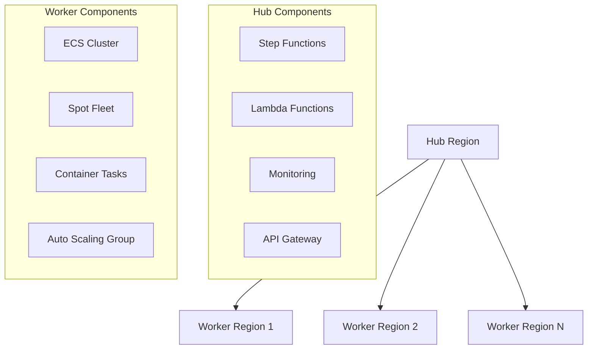
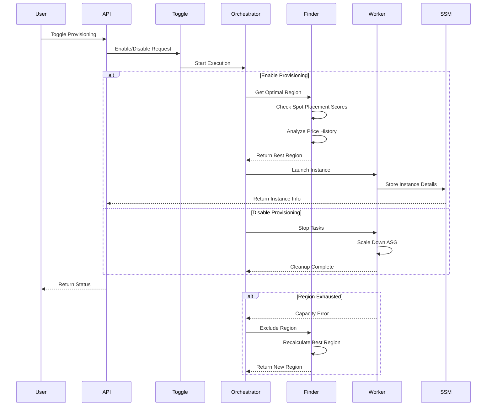
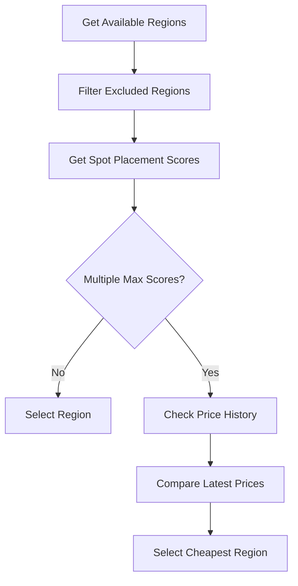
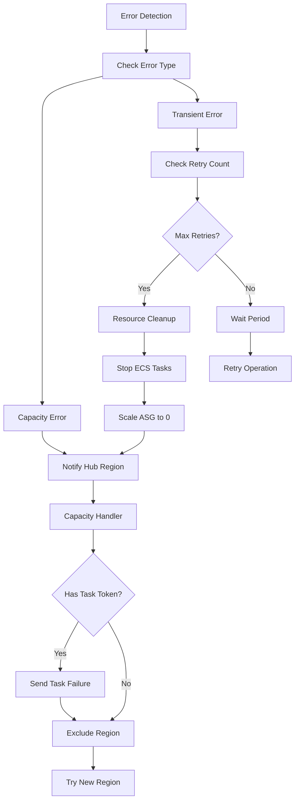

# AWS Spot Instance Management System Documentation

## 1. Project Overview

The AWS Spot Instance Management System is a comprehensive solution designed to provide cost-effective, reliable infrastructure for running interruptable workloads across multiple AWS regions. The system leverages AWS Spot Instances to reduce costs while implementing mechanisms to handle spot instance interruptions and ensure continuous service availability.

### 1.1 Core Objectives

- **Cost Optimization**: Utilize AWS Spot Instances to significantly reduce compute costs (up to 90% compared to On-Demand pricing)
- **High Availability**: Ensure continuous service availability through multi-region deployment and automated failover
- **Performance Optimization**: Minimize deployment latency and optimize container startup time
- **Operational Efficiency**: Automate deployment processes and streamline management tasks

### 1.2 Key Features

- Hub-worker architecture for centralized control
- Automated spot instance procurement based on availability and pricing
- Intelligent capacity planning and region selection
- Graceful handling of spot instance interruptions
- Cross-region failover mechanisms
- Container orchestration for workloads
- GPU support for compute-intensive tasks
- Comprehensive monitoring and alerting

## 2. System Architecture

The system follows a hub-worker architecture pattern where a central hub region coordinates activities across multiple worker regions.

### 2.1 High-Level Architecture



### 2.2 Hub Region Components

The hub region serves as the central control plane and contains:

1. **Step Functions**:
   - `SpotOrchestrator`: Coordinates spot instance provisioning across regions

2. **Lambda Functions**:
   - `SpotInstanceFinder`: Identifies optimal regions for spot instance deployment
   - `ToggleProvisioning`: Controls system-wide enabling/disabling of provisioning
   - `GetInstanceDetails`: Retrieves information about running instances
   - `SpotCapacityHandler`: Processes spot capacity events from worker regions

3. **API Gateway**:
   - Exposes REST endpoints for system management
   - Provides instance details and provisioning control

4. **EventBridge**:
   - Routes events between hub and worker regions
   - Handles cross-region communication

5. **SSM Parameter Store**:
   - Stores system state and configuration
   - Tracks current active region and instance details

### 2.3 Worker Region Components

Worker regions handle the actual spot instance lifecycle:

1. **Step Functions**:
   - `LaunchInstance`: Manages the spot instance launch process
   - `CapacityMonitor`: Monitors instance health and capacity
   - `TeardownInstance`: Handles graceful shutdown and cleanup

2. **Auto Scaling Group**:
   - Manages spot instance lifecycle
   - Configured for GPU instances

3. **ECS Cluster**:
   - Runs containerized workloads (currently runs SGLang inference framework)
   - Configured with GPU support

4. **Lambda Functions**:
   - `GetInstanceFromASG`: Retrieves instance details from Auto Scaling Group

5. **EventBridge**:
   - Processes spot interruption warnings
   - Communicates with hub region

6. **EFS**:
   - Provides persistent storage for model caching

## 3. Control Flow

### 3.1 Provisioning Flow



### 3.2 Spot Instance Selection Strategy



### 3.3 Error Handling Flow



## 4. Technical Implementation

### 4.1 Infrastructure as Code

The system is implemented using Terraform with a modular structure:

- `deploy/modules/hub/`: Hub region resources
- `deploy/modules/worker/`: Worker region resources
- `deploy/hub/`: Hub region deployment
- `deploy/worker/`: Worker region deployment

Key Terraform modules used:
- `terraform-aws-modules/ecs/aws`: Container orchestration
- `terraform-aws-modules/iam/aws`: IAM role management
- `terraform-aws-modules/step-functions/aws`: Workflow orchestration
- `terraform-aws-modules/eventbridge/aws`: Event routing
- `terraform-aws-modules/autoscaling/aws`: EC2 instance management
- `terraform-aws-modules/security-group/aws`: Network security
- `terraform-aws-modules/efs/aws`: Persistent storage
- `terraform-aws-modules/apigateway-v2/aws`: API management
- `terraform-aws-modules/lambda/aws`: Serverless functions

### 4.2 Lambda Functions

1. **Spot Instance Finder (`src/hub/spot_instance_finder/spot_instance_finder.py`)**:
   - Evaluates spot placement scores across regions
   - Analyzes price history for optimal region selection
   - Filters excluded regions
   - Returns the best region for spot instance deployment

2. **Toggle Provisioning (`src/hub/toggle_provisioning/toggle_provisioning.py`)**:
   - Controls system-wide enabling/disabling of provisioning
   - Updates SSM parameter for provisioning state
   - Starts/stops Step Function executions
   - Enables/disables EventBridge rules

3. **Get Instance Details (`src/hub/get_instance_details/get_instance_details.py`)**:
   - Retrieves current instance information from SSM Parameter Store
   - Returns region, IP address, and provisioning state

4. **Spot Capacity Handler (`src/hub/spot_capacity_handler/spot_capacity_handler.py`)**:
   - Processes spot capacity events from worker regions
   - Sends task success/failure to Step Functions
   - Handles region exclusion on capacity errors

5. **Get Instance from ASG (`src/worker/get_instance_from_asg/app.py`)**:
   - Retrieves instance details from Auto Scaling Group
   - Updates SSM Parameter Store with instance information

### 4.3 Step Functions

1. **Hub Orchestrator**:
   - Coordinates spot instance provisioning across regions
   - Handles region selection and failover
   - Manages system state through SSM Parameter Store

2. **Worker Launch Instance**:
   - Scales up Auto Scaling Group
   - Launches ECS tasks
   - Monitors instance health
   - Notifies hub region of success/failure

3. **Worker Capacity Monitor**:
   - Monitors spot instance capacity
   - Handles spot interruption warnings
   - Triggers failover when necessary

4. **Worker Teardown Instance**:
   - Stops ECS tasks
   - Scales down Auto Scaling Group
   - Cleans up resources

## 5. Deployment

### 5.1 Prerequisites

- AWS CLI configured
- Terraform installed
- Docker installed
- Python 3.x
- Shell environment (bash/zsh)

### 5.2 Deployment Process

The system is deployed using the `deploy.sh` script:

```bash
./deploy.sh --prefix <prefix> --hub <hub_region> --worker <worker_region1> [--worker <worker_region2> ...] [--hub-as-worker] --instance-type <instance_type>
```

Example:
```bash
./deploy.sh --prefix sglang --hub us-east-1 --worker us-west-2 --worker eu-west-1 --hub-as-worker --instance-type p5en.48xlarge
```

The deployment process:
1. Validates input parameters
2. Creates Terraform variable files
3. Deploys hub region resources
4. Deploys worker region resources in parallel

### 5.3 Teardown Process

The system can be torn down using the `teardown.sh` script:

```bash
./teardown.sh
```

The teardown process:
1. Identifies deployed worker regions
2. Destroys worker region resources
3. Destroys hub region resources
4. Cleans up temporary files

## 6. User Guide

### 6.1 API Specification

The system exposes a REST API through API Gateway for management:

#### 6.1.1 Get Spot Instance Details

**Endpoint**: `GET /spot-instances`

**Description**: Retrieves information about the currently running spot instance.

**Response**:
```json
{
  "region": "us-west-2",
  "instances": [
    {
      "instance_id": "i-0123456789abcdef0",
      "public_ip": "54.123.456.789",
      "private_ip": "10.0.0.123"
    }
  ]
}
```

#### 6.1.2 Toggle Spot Provisioning

**Endpoint**: `POST /spot-provisioning`

**Description**: Enables or disables spot instance provisioning.

**Request Body**:
```json
{
  "action": "enable|disable",
  "teardown": true|false
}
```

**Response**:
```json
{
  "message": "Spot provisioning enabled|disabled successfully"
}
```

### 6.2 Common Operations

#### 6.2.1 Enabling Spot Provisioning

1. Send a POST request to `/spot-provisioning` with `{"action": "enable"}`
2. The system will:
   - Update the provisioning state in SSM Parameter Store
   - Enable the EventBridge rule for monitoring
   - Start the spot orchestrator Step Function
   - Find the optimal region for spot instance deployment
   - Launch a spot instance in the selected region
   - Update the instance details in SSM Parameter Store

#### 6.2.2 Disabling Spot Provisioning

1. Send a POST request to `/spot-provisioning` with `{"action": "disable", "teardown": true}`
2. The system will:
   - Update the provisioning state in SSM Parameter Store
   - Disable the EventBridge rule for monitoring
   - Stop running Step Function executions
   - Send teardown signals to all worker regions
   - Scale down Auto Scaling Groups
   - Stop ECS tasks

#### 6.2.3 Checking Instance Status

1. Send a GET request to `/spot-instances`
2. The system will return:
   - The current active region
   - Instance details (ID, public IP, private IP)
   - Provisioning state

### 6.3 Monitoring and Troubleshooting

#### 6.3.1 CloudWatch Logs

- Lambda function logs: `/aws/lambda/<prefix>-*`
- Step Function logs: Available in the AWS Console
- ECS task logs: `/ecs/<prefix>`