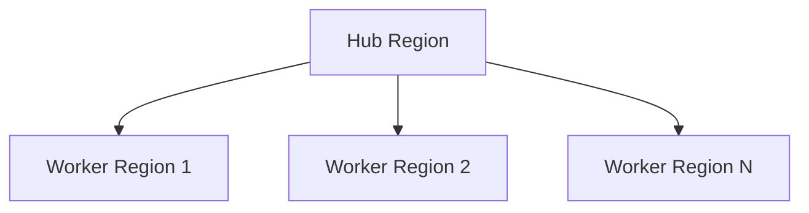

# AWS Spot Instance Cross-region Orchestration

A cost-effective system for managing AWS Spot Instances across multiple regions using a hub-worker architecture. The system automatically finds optimal regions for spot instance placement, handles instance interruptions, and ensures continuous service availability.

## Overview

The AWS Spot Instance Management System provides significant cost savings by leveraging AWS Spot Instances while implementing sophisticated mechanisms to handle spot instance interruptions. The system uses Step Functions, Lambda functions, and ECS to create a reliable infrastructure for running workloads across multiple AWS regions.

## Architecture

The system follows a hub-worker architecture:



### Hub Region

The hub region serves as the central control plane:
- Finds optimal regions based on spot placement scores and price history
- Coordinates spot instance provisioning across regions
- Handles instance interruptions and region failovers
- Maintains system state using SSM Parameter Store

### Worker Regions

Worker regions handle the actual spot instance lifecycle:
- Launch and terminate spot instances via Auto Scaling Groups
- Run ECS tasks on the spot instances
- Monitor instance health and capacity
- Handle graceful shutdowns on spot interruptions

## Deployment

Deploy the system using the provided script:

```bash
cd deploy
./deploy.sh --prefix <prefix> --hub <hub_region> --worker <worker_region1> [--worker <worker_region2> ...] [--hub-as-worker] --instance-type <instance_type>
```

Example:
```bash
./deploy.sh --prefix sglang --hub us-east-1 --worker us-west-2 --worker eu-west-1 --hub-as-worker --instance-type p5en.48xlarge
```

To tear down the infrastructure:
```bash
./teardown.sh
```

## API Usage

The system provides a REST API for management:

### Get Spot Instance Details

```bash
curl -X GET https://{api-id}.execute-api.{region}.amazonaws.com/{stage}/spot-instances
```

Response:
```json
{
  "region": "us-west-2",
  "instances": [
    {
      "instance_id": "i-0123456789abcdef0",
      "public_ip": "54.123.456.789",
      "private_ip": "10.0.0.123"
    }
  ]
}
```

### Toggle Spot Provisioning

```bash
# Enable spot provisioning
curl -X POST https://{api-id}.execute-api.{region}.amazonaws.com/{stage}/spot-provisioning \
  -H "Content-Type: application/json" \
  -d '{"action": "enable"}'

# Disable spot provisioning with teardown
curl -X POST https://{api-id}.execute-api.{region}.amazonaws.com/{stage}/spot-provisioning \
  -H "Content-Type: application/json" \
  -d '{"action": "disable", "teardown": true}'
```

## Key Features

- **Cost Optimization**: Utilize AWS Spot Instances for up to 90% cost savings
- **High Availability**: Multi-region deployment with automated failover
- **Intelligent Region Selection**: Based on spot placement scores and price history
- **Graceful Interruption Handling**: Automated response to spot instance interruptions
- **Cross-Region Failover**: Seamless workload migration between regions
- **Centralized Management**: Hub-worker architecture for simplified control

## Documentation

For more detailed information, refer to:
- [System Documentation](AWS_Spot_Instance_Management_System_Documentation.md)
- [API Guide](AWS_Spot_Instance_Management_System_API_Guide.md)

## Security

See [CONTRIBUTING](CONTRIBUTING.md#security-issue-notifications) for more information.

## License

This library is licensed under the MIT-0 License. See the LICENSE file.